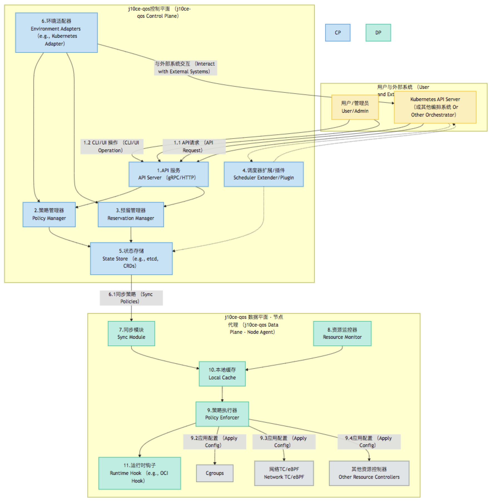

# j10ce-qos 架构设计

## 1. 引言

j10ce-qos 是一个旨在将服务质量 (QoS) 管理从 Kubernetes 核心 (in-tree) 模型中分离出来 (out-of-tree) 的开源项目。它的目标是提供一个可扩展的 QoS 框架，不仅适用于 Kubernetes 环境，还能延伸至其他容器化或非容器化环境。核心特性之一是引入了“最小资源预留 (MinimalReservation)”机制，以保障关键工作负载的稳定运行。

本项目的设计深受业界领先的资源管理和调度项目的启发，如字节跳动的 Katalyst [1][2] 和阿里云的 Koordinator [3]，并借鉴了 terway-qos [4] 在网络 QoS 方面的实践经验。j10ce-qos 致力于提供一个分层、模块化、易于扩展和集成的解决方案。

## 2. 设计目标

* **Out-of-Tree QoS**：将 QoS 管理逻辑与底层平台（如 Kubernetes）解耦，提高灵活性和可维护性。
* **可扩展性**：设计插件式架构，方便扩展到不同的运行时环境 (如 Docker, bare-metal) 和新的资源维度。
* **最小资源预留 (MinimalReservation)**：为指定的工作负载或系统组件预留最低资源保障，防止其因资源争抢而被饿死。
* **多维度资源管理**：支持 CPU、内存、网络带宽、磁盘 I/O 等多种资源的 QoS 管理。
* **统一策略定义**：提供声明式 API，用于定义 QoS 等级、资源预留策略和优先级。
* **可观测性**：内置监控和报告机制，方便用户了解资源分配和 QoS 执行情况。
* **兼容性**：优先确保与 Kubernetes 生态的良好兼容，并逐步扩展。

## 3. 核心概念

* **QoS 等级 (QoS Profile)**：定义一组资源控制参数和优先级。例如，可以定义 `GuaranteedPro` (包含最小预留)、`Guaranteed`、`Burstable`、`BestEffort` 等。
* **最小资源预留 (Minimal Reservation)**：一种特殊的资源请求，确保即使在系统高负载时，持有该预留的工作负载也能获得其声明的最小资源量。这高于普通 `Guaranteed` 请求的保障级别。
* **资源控制器 (Resource Controller)**：负责实际执行资源限制和保障的组件，如针对 CPU 的 CFS cgroups、内存的 memory cgroups、网络流量的 tc 或 eBPF 等。
* **环境适配器 (Environment Adapter)**：使 j10ce-qos 能够与特定环境（如 Kubernetes, Mesos, Standalone Linux）集成的插件。
* **策略执行器 (Policy Enforcer)**：根据定义的 QoS 策略和预留，在节点上配置资源控制器。

## 4. 整体架构

j10ce-qos 采用分层架构，主要包括控制平面 (Control Plane) 和数据平面 (Data Plane/Node Agent)。

**架构组件说明:**

  * **j10ce-qos 控制平面 (j10ce-qos Control Plane)**:

      * **API 服务 (API Server)**: 提供 RESTful 或 gRPC 接口，供用户、CLI 或其他系统（如 Kubernetes API Server 转发的请求）交互，用于定义和管理 QoS 策略及最小资源预留。
      * **策略管理器 (Policy Manager)**: 负责接收、校验、存储和分发 QoS 策略和配置。
      * **预留管理器 (Reservation Manager)**: 专门处理最小资源预留请求，确保预留的资源在调度和运行时得到保障。
      * **调度器扩展/插件 (Scheduler Extender/Plugin)**: (可选，主要用于 Kubernetes) 与原生调度器交互，影响 Pod 的调度决策，确保满足 QoS 和预留要求。
      * **状态存储 (State Store)**: 持久化存储 QoS 策略、预留信息、节点状态等。在 Kubernetes 环境中，可以利用 CRDs (Custom Resource Definitions)。
      * **环境适配器 (Environment Adapters)**: 允许控制平面与不同的目标环境（如 Kubernetes, Mesos）进行交互，例如通过 Kubernetes Adapter 监听和更新 CRD。

  * **j10ce-qos 数据平面 - 节点代理 (j10ce-qos Data Plane - Node Agent)**:

      * 部署在每个受管节点上。
      * **同步模块 (Sync Module)**: 从控制平面（或其状态存储）同步最新的 QoS 策略和预留信息到本地。
      * **资源监控器 (Resource Monitor)**: 收集节点和容器的实时资源使用情况 (CPU, 内存, 网络, 磁盘 I/O)。
      * **策略执行器 (Policy Enforcer)**: 根据同步到的策略和本地资源使用情况，通过底层的资源控制机制（如 Cgroups, TC, eBPF）来配置和调整容器的资源限制和保障。
      * **本地缓存 (Local Cache)**: 存储从控制平面同步来的策略以及本地监控数据，减少对控制平面的依赖，提高响应速度。
      * **运行时钩子 (Runtime Hook)**: (可选) 例如 OCI hook，在容器生命周期的特定点（如创建前）介入，进行 QoS 相关的预配置。

## 5\. 部署架构 (Kubernetes 示例)

在 Kubernetes 环境中，j10ce-qos 的典型部署方式如下：

  * **j10ce-qos-controller-manager**: 作为 Kubernetes Deployment 运行，负责处理 CRD（如 `QoSProfile`, `MinimalReservationPolicy`），与 Kubernetes Scheduler 交互（如果作为调度器扩展），并将策略分发（通常通过更新 CRD status 或 ConfigMaps）给节点代理。
  * **j10ce-qos-agent**: 作为 Kubernetes DaemonSet 在每个工作节点上运行。它会监视分配到该节点的 Pods，从 API Server 获取相关的 QoS 策略和预留信息，监控本地资源使用，并实际应用资源隔离和保障措施（如配置 Cgroups, tc qdisc, eBPF 程序等）。

## 6\. 核心流程示例：Pod QoS 与最小预留保障

1.  **定义策略 (Define Policy)**: 用户创建一个 `MinimalReservationPolicy` CRD，声明某个 namespace 下的 Pods 享有特定的CPU和内存最小预留。同时，用户也可能创建 `QoSProfile` CRD 来定义更细致的 QoS 等级。
2.  **控制平面处理 (Control Plane Processing)**:
      * `j10ce-qos-controller-manager` 监听到新的 CRD。
      * `Policy Manager` 和 `Reservation Manager` 解析 CRD，验证其有效性，并更新到内部状态存储（或 CRD status）。
      * 如果配置为调度器扩展，`Scheduler Extender` 会在 Pod 调度时，根据这些策略和预留信息，向原生调度器提供优选节点或过滤不满足条件的节点。
3.  **节点代理执行 (Node Agent Enforcement)**:
      * `j10ce-qos-agent` 在其节点上监听到新的 Pod 创建或更新，或者策略更新。
      * `Sync Module` 从 API Server（或本地缓存）获取与该 Pod 相关的 `MinimalReservationPolicy` 和 `QoSProfile`。
      * `Resource Monitor` 持续监控节点和 Pod 的资源使用。
      * `Policy Enforcer` 根据策略计算出具体的资源控制参数（如 cgroup 的 `cpu.shares`, `cpu.cfs_quota_us`, `memory.limit_in_bytes`, `memory.low` 等），并调用相应的运行时钩子或直接操作 Cgroups、网络子系统等来应用这些设置。对于最小预留，可能会使用 cgroup v2 的 `memory.low` 或其他机制来保障。
4.  **持续监控与调整 (Continuous Monitoring & Adjustment)**:
      * `j10ce-qos-agent` 持续监控，确保 QoS 目标达成。
      * (未来扩展) 基于实时负载动态调整某些可突发资源的分配（在保障最小预留和QoSProfile的前提下）。

## 7\. 可扩展性设计

  * **插件化资源控制器**: `Policy Enforcer` 可以加载不同的插件来支持新的资源控制技术 (如新的 cgroup特性、不同的网络 QoS 技术)。
  * **插件化环境适配器**: `Environment Adapter` 接口允许添加对新平台的支持，如 Mesos、Nomad 或裸金属服务器。
  * **自定义 QoS 策略**: 用户可以通过 API 定义自己的 QoS 等级和参数。
  * **模块化监控**: `Resource Monitor` 可以集成不同的监控数据源。

## 8\. 技术栈选型（初步）

  * **主要编程语言**: Go (与 Kubernetes 生态一致)
  * **API**: gRPC, REST (Kubernetes CRDs for K8s integration)
  * **节点资源控制**: Cgroups (v1 & v2), Linux Traffic Control (tc), eBPF (for advanced network QoS and monitoring)
  * **配置与状态存储**: Etcd (for standalone control plane), Kubernetes CRDs (when in K8s)

## 9\. 参考资料

- [1] Katalyst: A QoS-based resource management system for workload colocation on kubernetes | CNCF. (2023-12-26). Retrieved from [https://www.cncf.io/blog/2023/12/26/katalyst-a-qos-based-resource-management-system-for-workload-colocation-on-kubernetes/](https://www.cncf.io/blog/2023/12/26/katalyst-a-qos-based-resource-management-system-for-workload-colocation-on-kubernetes/)
- [2] Katalyst: A QoS-Based Resource Management System. (N.D.). DZone. Retrieved from [https://dzone.com/articles/katalyst-a-qos-based-resource-management-system-fo](https://dzone.com/articles/katalyst-a-qos-based-resource-management-system-fo)
- [3] Koordinator v0.1.0 - QoS based scheduling system | Koordinator. (N.D.). koordinator.sh. Retrieved from [https://koordinator.sh/zh-Hans/blog/release-v0.1.0/](https://www.google.com/search?q=https://koordinator.sh/zh-Hans/blog/release-v0.1.0/)
- [4] GitHub - AliyunContainerService/terway-qos: The QoS project is a cloud-native solution leveraging eBPF technology, designed to efficiently manage and optimize network traffic across diverse hybrid deployment scenarios. (N.D.). Retrieved from [https://github.com/AliyunContainerService/terway-qos](https://github.com/AliyunContainerService/terway-qos)
- [5] GitHub - kmmelcher/k8s-qos-scheduler-with-kwok. (N.D.). Retrieved from [https://github.com/kmmelcher/k8s-qos-scheduler-with-kwok](https://www.google.com/search?q=https://github.com/kmmelcher/k8s-qos-scheduler-with-kwok)
- [6] GitHub - giovannifs/qos-driven-scheduler-kubernetes: Production-Grade Container Scheduling and Management. (N.D.). Retrieved from [https://github.com/giovannifs/qos-driven-scheduler-kubernetes](https://github.com/giovannifs/qos-driven-scheduler-kubernetes)